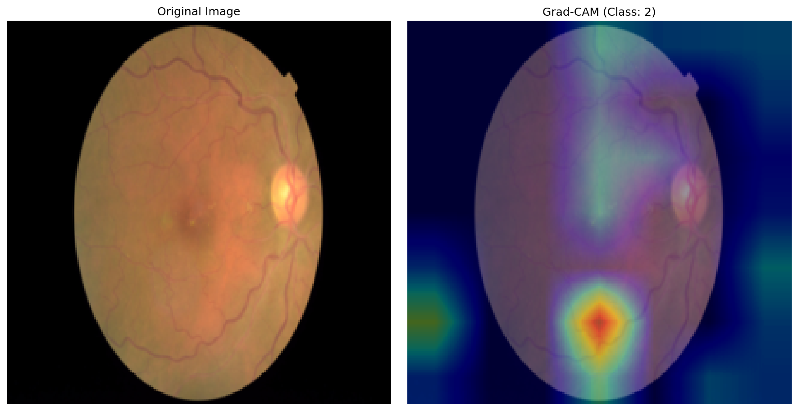

# Diabetic Retinopathy Detection with Grad-CAM

This project uses **MobileNetV3** to classify diabetic retinopathy stages from fundus images. It integrates **FastAPI** for real-time inference and visual explanation with **Grad-CAM**.

## ✨Features

- MobileNetV3 trained on the APTOS 2019 dataset
- Custom preprocessing (CLAHE, denoising, border removal)
- Balanced sampling for imbalanced dataset
- Grad-CAM heatmaps for explainability
- FastAPI backend with image upload and prediction endpoint
- Heatmap visualization and dynamic cleanup

## Example

<p align="center">
  
</p>

## Model

- Architecture: MobileNetV3 Small
- Input size: 224x224
- Classes: 5 (No DR → Proliferative DR)
- Optimizer: Adam
- Loss: CrossEntropy with label smoothing
- Scheduler: ReduceLROnPlateau

## Installation

```bash
git clone https://github.com/yourusername/diabetic-retinopathy-fastapi.git
cd diabetic-retinopathy-fastapi
pip install -r requirements.txt
```

## Run API Server

```bash
uvicorn app:app --reload
```

Then open: [http://localhost:8000/docs](http://localhost:8000/docs)

## API Endpoints

### POST `/predict`
Upload a retina image and get:
- predicted class
- confidence score
- Grad-CAM heatmap URL


### GET `/heatmap/{file_id}`
Retrieve generated Grad-CAM overlay.

---

## Project Structure

```
├── app.py                  # FastAPI app with Grad-CAM
├── model.py                # MobileNetV3 model definition
├── mobilenet_dr_weights.pth  # Trained model weights
├── outputs/                # Generated Grad-CAM images
├── notebook/               # Training and EDA notebook
├── requirements.txt        # Python dependencies
├── render.yaml             # Optional Render deployment config
└── ProcfIle                # For deployment platforms
```

---

## Dataset

APTOS 2019 Blindness Detection  
[Kaggle link](https://www.kaggle.com/competitions/aptos2019-blindness-detection/data)

---

## 🙌 Acknowledgements

- APTOS dataset
- TorchCAM for Grad-CAM
- FastAPI for elegant backend interface
